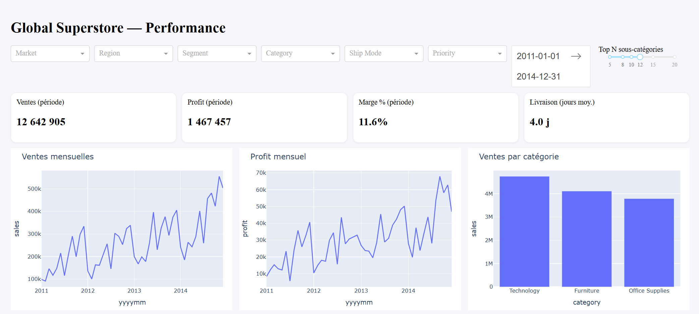
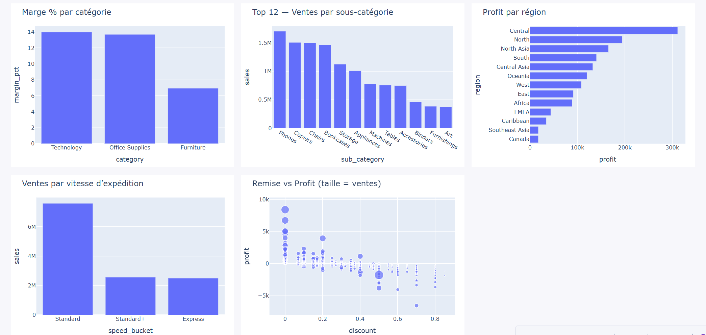

# Global Superstore — ETL & Dashboard 

Projet end‑to‑end : **ETL Python → PostgreSQL (schéma en étoile) → Dashboard Dash**.

---

## 1) Ce que fournit le projet
- Pipeline **ETL** robuste (TXT/CSV/Excel → nettoyage/typage → modèle en étoile → chargement Postgres).
- **Entrepôt** : `fact_sales` + `dim_date/customer/product/geography/ship/priority`.
- **Dashboard** interactif (Dash/Plotly) : filtres **Market/Region/Segment** + **période**, **4 KPI**, **8 graphiques**.

---

## 2) Stack
- **Python** (pandas, SQLAlchemy, python‑dotenv, dash/plotly, openpyxl si Excel)
- **PostgreSQL 15** (Docker)

---

## 3) Structure du dépôt (complète)
```
retail-etl-superstore/
├─ analytics/
│  └─ dash_app/
│     └─ app.py                 
│     
├─ data/
│  ├─ raw/
│    └─ GlobalSuperstore.txt   # (ou .csv / .xlsx)
│
├─ docs/
│  └─ images/                   # captures pour le README
│     ├─ dashboard-1.png
│     ├─ dashboard-2.png
│     └─ dashboard-3.png
│
├─ etl/
│  ├─ config.py                 # lecture des variables .env
│  ├─ extract.py                # lecture & normalisation colonnes/typage
│  ├─ transform.py              # dimensions + table de faits
│  ├─ load.py                   # chargement Postgres (full refresh)
│  └─ run_etl.py                # orchestration ETL
│
├─ sql/
│  ├─ ddl_star_schema.sql       # création des tables du schéma en étoile
│  └─ indices.sql               # index recommandés
│
├─ tests/
│  └─ data_checks.py            
│
├─ .env.example                         # configuration locale 
├─ requirements.txt
└─ README.md                    
```

## 4) Installation & configuration
**Prérequis :** Docker, Python 3.9+

**Dépendances**
```bash
python -m venv .venv && source .venv/bin/activate  # Windows: .\.venv\Scripts\Activate
pip install -r requirements.txt
```


**Base PostgreSQL (Docker)**
```bash
docker run --name pg-ss -e POSTGRES_USER=postgres -e POSTGRES_PASSWORD=postgres -e POSTGRES_DB=superstore -p 5432:5432 -d postgres:15
```

---

## 5) Exécution
**ETL (chargement complet)**
```bash
python -m etl.run_etl
```
**Dashboard**
```bash
python analytics/dash_app/app.py
```
Ouvrir : `http://127.0.0.1:8050`

---

## 6) Modèle de données (étoile)
**Fait** : `fact_sales(order_id, order_line, order_date_key, ship_date_key, customer_id, product_id, geo_key, ship_mode, priority, sales, profit, discount, quantity, shipping_cost, shipping_days)`

**Dimensions** :
- `dim_date(date_key, date, year, quarter, month, day, week, is_weekend, yyyymm, yyyyqq)`
- `dim_customer(customer_id, customer_name, segment)`
- `dim_product(product_id, product_name, category, sub_category)`
- `dim_geography(geo_key, country, state, city, region, market, market2)`
- `dim_ship(ship_mode, speed_bucket)`
- `dim_priority(priority, priority_rank)`

---

## 7) Analytics inclus
**KPI** (période filtrée) : Ventes, Profit, **Marge %**, Jours de livraison (moy.).

**Graphiques (8)** :
1. Ventes mensuelles  
2. Profit mensuel  
3. Ventes par catégorie  
4. Marge % par catégorie  
5. Top 12 sous‑catégories  
6. Profit par région (horizontal)  
7. Ventes par mode d’expédition  
8. Remise vs Profit (bulles)

---

## 8) Captures d’écran du dashboard

<p align="center">
  
  
</p>


## 9) Crédits
- Données : *Global Superstore* (Kaggle) — usage éducatif.
- Code : MIT (adapter si besoin).

